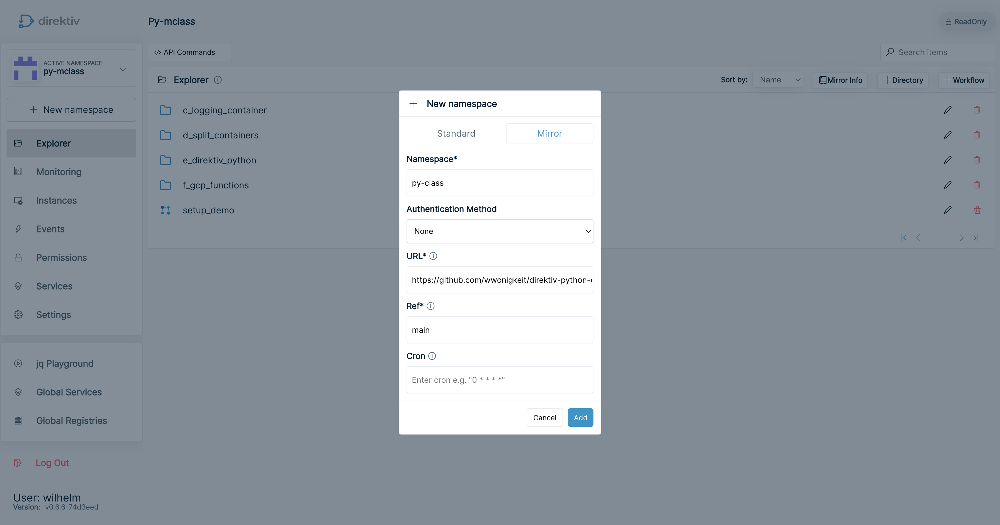
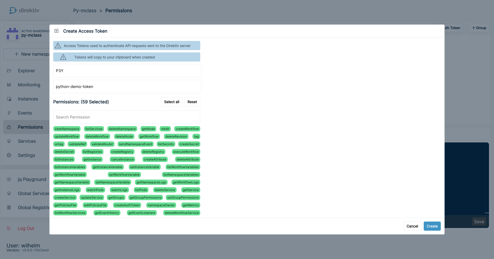

# Direktiv Python Demo

This repository is mean to be used to explain how you would transition from a typical Python script to a Direktiv workflow, running the Python script as a container or function.

## Setup Direktiv

1. Clone the repository https://github.com/wwonigkeit/direktiv-python-demo into a namespace in your Direktiv instance (shown below) with the main branch:



2. Create an API authentication token for Direktiv. If you're running the open-source version of Direktiv, this is set during the install in the direktiv.yaml file or the Docker start-up ```docker run -e APIKEY=123 --privileged -p 8080:80 -ti direktiv/direktiv-kube ```. For the enterprise edition create the API auth token from the "Permissions" tab (shown below):



3. Run the setup_demo.yaml workflow. It will create 2 secrets in the namespace. The workflow needs the following:
 - GCP Key: this is a JSON file in the format below:
```json
{
    "type":"service_account",
    "project_id":"direktiv",
    "private_key_id":"<key_id>",
    "private_key":"<key>",
    "client_email":"<account-name>",
    "client_id":"<client-id>",
    "auth_uri":"https://accounts.google.com/o/oauth2/auth",
    "token_uri":"https://oauth2.googleapis.com/token",
    "auth_provider_x509_cert_url":"https://www.googleapis.com/oauth2/v1/certs",
    "client_x509_cert_url":"https://www.googleapis.com/robot/v1/metadata/x509/demo-translation-sa%40direktiv.iam.gserviceaccount.com"
}
```
 - Twitter Bearer Token: this is the Twitter API Bearer Token you get when you sign up for a Twitter Developer account
 - Direktiv Auth Token: token created in step 2
 - Direktiv Namespace: the current namespace you created
 - Direktiv URL: in the format https://<uri> (no trailing slash)


## Python demo flow

The basic function of the code being used is:
 1. Connnect to Twitter and execute a search against a specific string (Python)
 2. Detect the langagues for each of the Tweets using the Google Translation Service (Python)

### Simple Python script (a_code_example)
This is a simple Python script which executes the above 2 steps. To run the script create a ```config.json``` file with the following format:

 ```json
{
   "bearer_token": "<token>",
   "gcp_projectid": "<gcp_project_id>",
   "gcp_location": "<gcp_location>",
   "twitter_searchstring": "direktiv",
   "max_search_returns": 10,
   "gcp_key":
    {
        "type":"service_account",
        "project_id":"direktiv",
        "private_key_id":"<key_id>",
        "private_key":"<key>",
        "client_email":"<account-name>",
        "client_id":"<client-id>",
        "auth_uri":"https://accounts.google.com/o/oauth2/auth",
        "token_uri":"https://oauth2.googleapis.com/token",
        "auth_provider_x509_cert_url":"https://www.googleapis.com/oauth2/v1/certs",
        "client_x509_cert_url":"https://www.googleapis.com/robot/v1/metadata/x509/demo-translation-sa%40direktiv.iam.gserviceaccount.com"
    }
}
 ```
 ```bash
$ ./test.sh 
Input file is  config.json
Output file is  output.json
Twitter text: @JTvill30 @perstrangberg Det första en ny regering måste göra är att byta ut VD Anna Borg samt delar av styrelsen, främst kärnkraftmotståndarna Kåberger o Bergman. 
Borgs månadslön på 1,3 miljoner kan nog bantas till hälften för en ny VD. Sen direktiv att bygga ny kärnkraft!
Language code: sv
Confidence: 0.7717858552932739
:
:
Completed twitter scrape and language detection
 ```